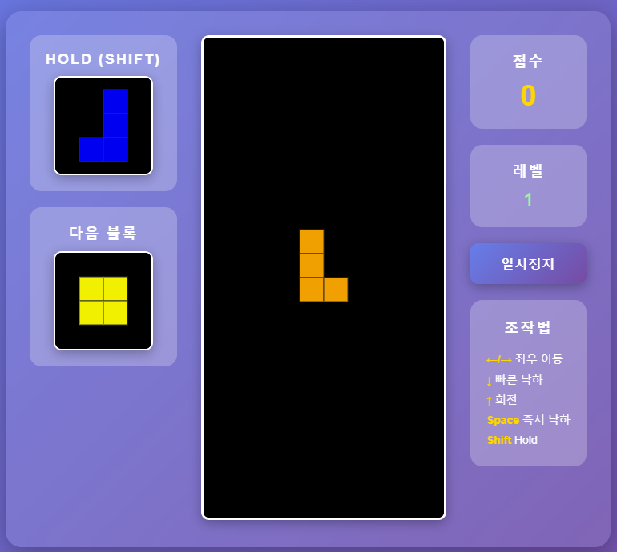

# 🎮 Tetris Game v2.0

> 블록을 회전시키고 쌓아 올려 줄을 제거하는 고전 테트리스 게임입니다.  
> HTML + CSS + JavaScript로 구현했으며, 직관적인 조작과 부드러운 애니메이션을 제공합니다.

---

## 📸 미리보기

<div align="center">
  
</div>

---

## 🎉 버전 2.0 업데이트 내역

### ✨ 새로운 기능

-   🎒 **Hold 기능 추가**: Shift 키로 블록을 보관하고 나중에 사용 가능!
-   📐 **UI 레이아웃 개선**: 왼쪽에 Hold/Next 블록, 오른쪽에 점수/레벨 표시
-   🎨 **3단 레이아웃**: 왼쪽(Hold/Next) - 중앙(게임판) - 오른쪽(정보) 구조

### 🔧 개선 사항

-   Hold 블록이 왼쪽 상단에 독립적으로 배치
-   다음 블록 미리보기가 Hold 아래로 이동
-   더욱 직관적인 화면 구성

---

## ✨ 주요 기능

### 🎒 Hold 기능 (NEW in v2.0!)

-   **Shift 키**를 눌러 현재 블록을 보관
-   보관된 블록은 왼쪽 상단에 표시
-   한 번 더 Shift를 누르면 현재 블록과 **교환**
-   **제한**: 한 블록당 1번만 사용 가능 (블록이 바닥에 닿으면 초기화)
-   **전략적 플레이**: I 블록을 아껴두고 Tetris(4줄)를 노려보세요!

### 🎲 7-Bag 시스템 (공정한 블록 생성)

-   7가지 블록(I, O, T, L, J, S, Z)이 한 세트로 구성
-   세트 안에서 랜덤하게 섞여서 등장
-   특정 블록이 너무 자주 나오거나 안 나오는 문제 해결
-   **예시**: I블록이 7개 안에 최소 1번은 반드시 등장!

### 👀 다음 블록 미리보기 (위치 변경!)

-   **왼쪽 패널**에 다음에 나올 블록 표시
-   Hold 기능 바로 아래 배치
-   전략적인 플레이 가능
-   실시간으로 업데이트

### 📊 점수 및 레벨 시스템

-   **점수 계산**: 줄 개수 × 100 × 현재 레벨
-   **레벨 상승**: 1000점마다 레벨 자동 증가
-   **난이도 증가**: 레벨이 오를수록 블록 낙하 속도 상승

### ⏸️ 게임 컨트롤

-   **일시정지**: 언제든지 게임 정지/재개 가능
-   **즉시 낙하**: 스페이스바로 블록 빠르게 떨어뜨리기
-   **재시작**: 게임 오버 시 원클릭으로 재시작

---

## 🎮 조작법

### ⌨️ 키보드 컨트롤

|   키    |      동작       | 설명                          |
| :-----: | :-------------: | :---------------------------- |
|   `←`   |  **왼쪽 이동**  | 블록을 한 칸 왼쪽으로 이동    |
|   `→`   | **오른쪽 이동** | 블록을 한 칸 오른쪽으로 이동  |
|   `↓`   |  **빠른 낙하**  | 블록이 빠르게 떨어짐          |
|   `↑`   |    **회전**     | 블록을 시계방향으로 90도 회전 |
| `Space` |  **즉시 낙하**  | 블록이 바닥까지 즉시 떨어짐   |
| `Shift` |   **Hold** 🆕   | 현재 블록 보관/교환           |

### 🖱️ 버튼 컨트롤

|     버튼      | 동작                                     |
| :-----------: | :--------------------------------------- |
| **일시정지**  | 게임을 멈추고 다시 시작                  |
| **다시 시작** | 게임을 처음부터 다시 시작 (게임 오버 시) |

---

## 🎯 게임 규칙

### 📋 기본 규칙

1. **블록 쌓기**: 떨어지는 블록을 좌우로 움직이고 회전시켜 바닥에 쌓습니다
2. **줄 완성**: 가로줄이 블록으로 꽉 차면 그 줄이 사라집니다
3. **게임 오버**: 블록이 화면 맨 위까지 쌓이면 게임이 끝납니다
4. **생존**: 최대한 오래 살아남으면서 높은 점수를 획득하세요!

### 💯 점수 계산 방법

| 동시에 지운 줄 수 |  점수 공식   | 레벨 1 예시 | 레벨 5 예시 |
| :---------------: | :----------: | :---------: | :---------: |
|   1줄 (Single)    | `100 × 레벨` |    100점    |    500점    |
|   2줄 (Double)    | `200 × 레벨` |    200점    |   1,000점   |
|   3줄 (Triple)    | `300 × 레벨` |    300점    |   1,500점   |
|   4줄 (Tetris)    | `400 × 레벨` |    400점    |   2,000점   |

> 💡 **팁**: 한 번에 4줄을 지우는 "Tetris"가 가장 효율적입니다!

### 📈 레벨 시스템

-   **레벨 상승 조건**: 1000점 달성할 때마다 레벨 1씩 증가
-   **레벨 효과**: 레벨이 오를수록 블록 낙하 속도가 빨라집니다
-   **속도 변화**:
    -   레벨 1: 1.0초에 1칸
    -   레벨 2: 0.9초에 1칸
    -   레벨 3: 0.8초에 1칸
    -   레벨 10+: 0.1초에 1칸 (최대 속도)

---

## 🎒 Hold 기능 사용 가이드

### 기본 사용법

1. **첫 번째 Hold**: 현재 블록을 보관하고 다음 블록이 등장
2. **두 번째 Hold**: 보관된 블록과 현재 블록을 교환
3. **제한**: 블록이 바닥에 닿을 때까지 1번만 사용 가능
4. **초기화**: 블록이 바닥에 닿으면 다시 Hold 사용 가능

### 전략적 활용법

#### 🎯 **I 블록 보관 전략**

```
상황: I 블록이 나왔는데 아직 4줄을 쌓을 준비가 안 됨
→ Shift로 I 블록을 Hold
→ 다른 블록들로 평평하게 쌓기
→ 4줄 준비 완료 시 Shift로 I 블록 꺼내기
→ Tetris! (400점 × 레벨)
```

#### 🚨 **위기 상황 대처**

```
상황: 불편한 블록(S, Z)이 나와서 구멍이 생길 것 같음
→ Shift로 Hold에 보관
→ 더 적합한 블록으로 교환
→ 안정적인 플레이 유지
```

#### 🔄 **블록 순서 조정**

```
상황: 지금 필요한 블록이 Hold에 있음
→ Shift로 교환
→ 딱 맞는 타이밍에 블록 사용
→ 효율적인 줄 제거
```

---

## 🚀 빠른 시작

### 1️⃣ 프로젝트 다운로드

#### Git이 있는 경우

```bash
git clone https://github.com/your-username/tetris-game.git
cd tetris-game
```

#### Git이 없는 경우

1. 페이지 상단의 **초록색 "Code"** 버튼 클릭
2. **"Download ZIP"** 선택
3. 다운로드한 ZIP 파일 압축 해제

### 2️⃣ 파일 확인

```
tetris-game/
├── index.html    ← 이것을 더블클릭!
├── style.css
├── main.js
└── gameplay_img/
    └── tetris_gameplay.png
```

### 3️⃣ 게임 실행

`index.html` 파일을 **더블클릭**하면 브라우저에서 게임이 실행됩니다!

---

## 📂 파일 구조

```
📦 tetris-game
 ┣ 📂 gameplay_img
 ┃ ┗ 📜 tetris_gameplay.png  # 게임 스크린샷
 ┣ 📜 index.html              # 메인 HTML 파일 (게임 화면 구조)
 ┣ 📜 style.css               # 스타일시트 (디자인, 색상, 레이아웃)
 ┣ 📜 main.js                 # 게임 로직 (블록 이동, 충돌 감지, Hold 기능)
 └ 📜 README.md               # 프로젝트 설명서
```

---

## 🛠️ 기술 스택

<div align="center">

|         기술          | 용도                                |
| :-------------------: | :---------------------------------- |
|       **HTML5**       | 게임 구조 및 Canvas API             |
|       **CSS3**        | 스타일링, 애니메이션, Glassmorphism |
| **JavaScript (ES6+)** | 게임 로직, 이벤트 처리, Hold 시스템 |

</div>

## 💡 고급 플레이 팁

1. **4줄 대기 전략**: I 블록을 Hold하고 오른쪽에 공간 비워두기
2. **Back-to-Back Tetris**: 연속으로 4줄 지우기로 보너스 점수
3. **블록 시퀀스 기억**: 7-Bag 시스템 활용해서 다음 세트 예측
4. **속도 적응**: 높은 레벨에서도 침착하게 판단하기

---

## 📜 버전 히스토리

### v2.0 (2024-11-24)

-   🎒 Hold 기능 추가
-   📐 UI 레이아웃 개선 (3단 구조)
-   🎨 Hold/Next 블록 왼쪽 패널로 이동

### v1.0 (2024-11-20)

-   🎮 기본 테트리스 게임 구현
-   🎲 7-Bag 시스템 추가
-   👀 다음 블록 미리보기 추가
